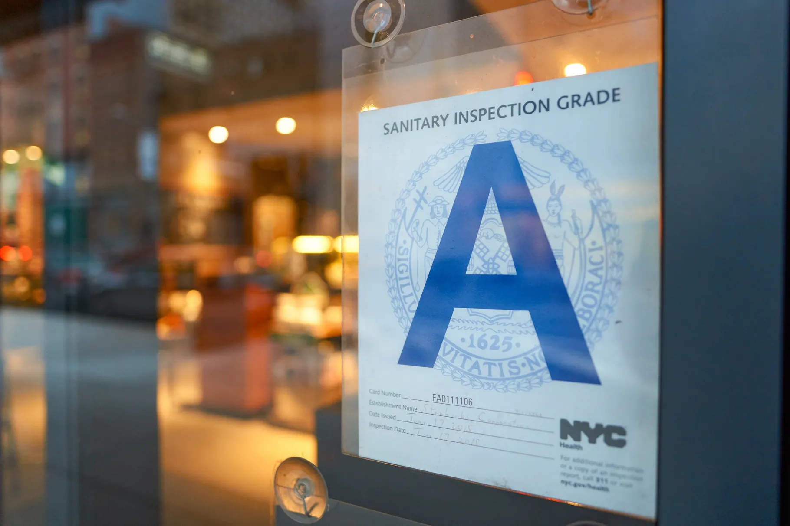

# Applied Data Science @ Columbia
## Fall 2022
## Project 2: Shiny App Development

### [Project Description](doc/)



Term: Fall 2022

+ **Project title**: DOHMH New York City Restaurant Inspection Results

+ **Team members**:
	+ Kieu-Giang Nguyen, kn2521@columbia.edu
	+ Zhejing Shi, zs2524@columbia.edu
	+ Judy Wu, dw2936@columbia.edu

+ **Project summary**: In this second project of GR5243 Applied Data Science, we develop a *Exploratory Data Analysis and Visualization* shiny app on the work of Department of Health and Mental Hygiene (DOHMH) using NYC open data released on the [NYC Open Data By Agency](https://opendata.cityofnewyork.us/data/) website. In particular, our app provides ways for a user to explore quantiative measures of how COVID-19 has impacted restaurant inspection activities in NYC from different perspectives, which then allows city officials to consolidate trends from different neighborhoods and different time periods to make meaningful comparison.

+ **Notifications about the app** : NOTE: Under the shinny app, number of violations interative map may runs slowly because the map contains too much information.  In alternative, number of violations interactive maps can be viewed via html file under doc folder 

+ **Contribution statement**: All three of us designed the study. Kieu-Giang developed the violation trend visualizations and presented the app. Zhejing developed the violation interactive maps. Judy developed the comparison visualizations and constructed the app. All team members contributed to the GitHub repository. All team members approve our work presented in our GitHub repository including this contribution statement.

This folder is orgarnized as follows.

```
proj/
├── app/
	└── output/
├── data/
├── doc/
├── figs/
└── lib/

```

Please see each subfolder for a README file.
